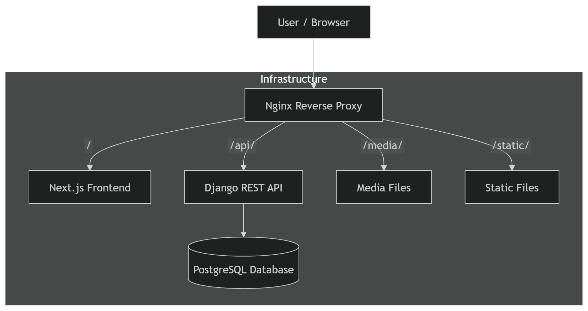
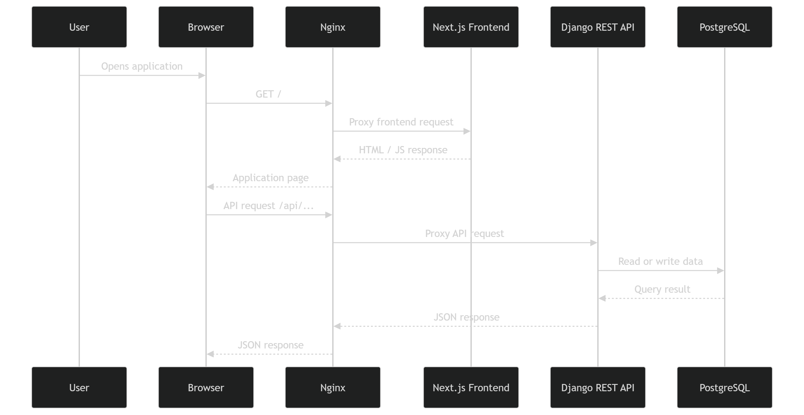

# Architecture Documentation

Edu Topic Manager is a full-stack monorepo application.

It consists of:

- Next.js frontend;
- Django REST Framework backend;
- PostgreSQL database;
- Nginx reverse proxy;
- Docker Compose infrastructure.

## Global Architecture

The application is accessed through Nginx. Nginx routes frontend requests to the Next.js service and API requests to the Django backend.



Diagram source:

```txt
docs/assets/diagrams/sources/global-architecture.mmd
```

## Request Flow

The common request flow contains two main parts:

- loading the frontend application;
- sending API requests to the backend.



Diagram source:

```txt
docs/assets/diagrams/sources/request-flow.mmd
```

## Monorepo Structure

```txt
edu_topic_manager/
├── backend/
├── frontend/
├── nginx/
├── docs/
├── docker-compose.yml
├── docker-compose.deploy.yml
├── Makefile
└── package.json
```

## Frontend Responsibility

The frontend is responsible for:

- rendering pages;
- handling user interaction;
- validating forms;
- communicating with the backend API;
- managing server state with React Query;
- handling authentication retry logic.

## Backend Responsibility

The backend is responsible for:

- authentication;
- authorization;
- business rules;
- database models;
- API endpoints;
- validation;
- file handling;
- permissions.

## Database Responsibility

PostgreSQL stores application data:

- users;
- students;
- teachers;
- topics;
- topic files;
- topic steps;
- reference data.

## Nginx Responsibility

Nginx is used as a reverse proxy.

It routes requests to the correct service:

```txt
/api/      → backend
/static/   → backend static files
/media/    → backend media files
/          → frontend
```

## Authentication Architecture

Protected frontend requests are sent through the shared auth-aware API client.

If the backend returns `401 Unauthorized`, the frontend tries to refresh the session and then retries the original request once.

General flow:

```txt
Protected request
  ↓
authClient
  ↓
Backend API

If 401:
  ↓
refresh session
  ↓
retry original request
```

## Development Principles

- Keep frontend and backend responsibilities separated.
- Keep shared frontend infrastructure in the `shared` layer.
- Keep business entity logic in the `entities` layer.
- Keep user actions and mutation flows in the `features` layer.
- Keep backend domain logic inside the related Django app.
- Keep documentation and diagrams synchronized with code changes.
- Store diagram sources together with exported diagram images.
