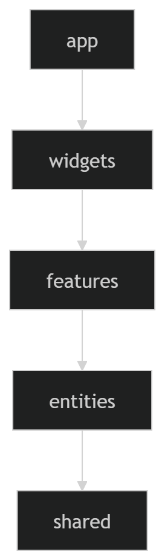
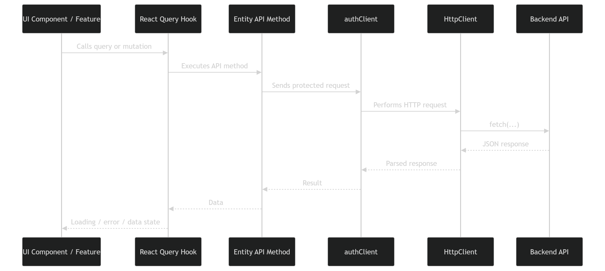
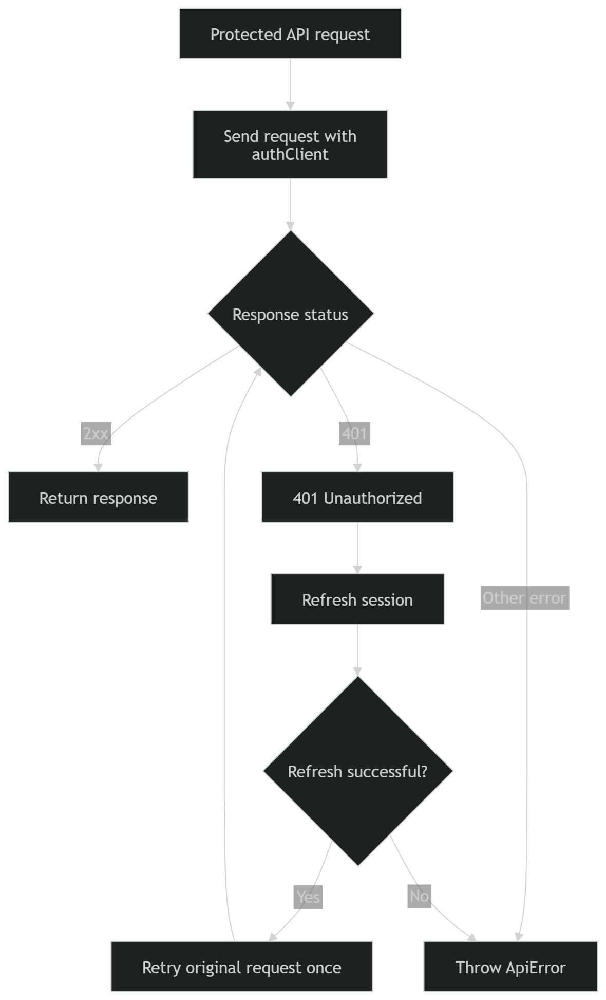

# Frontend Documentation

The frontend is a Next.js application written in TypeScript.

It is responsible for user interface, routing, client-side validation, API communication and user interactions with topics, students, teachers and authentication flows.

## Tech Stack

- Next.js
- React
- TypeScript
- TanStack React Query
- React Hook Form
- Zod
- SCSS Modules
- Vitest
- Testing Library
- ESLint
- Prettier

## Structure

The frontend follows a Feature-Sliced Design inspired structure.

```txt
frontend/src/
├── app/        # Next.js app routes and app-level providers
├── entities/   # Business entities
├── features/   # User actions and feature logic
├── shared/     # Shared API, UI, libs and utils
├── widgets/    # Composite UI blocks
├── styles/     # Global styles and SCSS variables
└── mocks/      # Mock/test-related utilities
```

## FSD Layers

The frontend is divided into layers. Higher layers may use lower layers, but lower layers should not depend on higher layers.



Diagram source:

```txt
docs/assets/diagrams/sources/frontend-fsd-layers.mmd
```

## Layers

### `app`

Contains application-level routing, layouts, providers and global configuration.

Use this layer for:

- Next.js routes;
- layouts;
- app-level providers;
- global application setup.

### `widgets`

Contains large UI blocks composed from entities, features and shared components.

Use this layer for page sections and complex interface blocks.

### `features`

Contains user-facing actions.

Examples:

- login by credentials;
- create topic;
- update topic;
- delete topic;
- create student;
- edit student;
- create teacher;
- edit teacher.

Feature code may include:

- forms;
- validation schemas;
- mutation hooks;
- feature-specific UI.

### `entities`

Contains business entities used across the application.

Examples:

- topic;
- user;
- student;
- teacher;
- session.

Entity code may include:

- API methods;
- types;
- query keys;
- entity-specific UI;
- helper functions.

### `shared`

Contains reusable project-level code.

Examples:

- API clients;
- common UI components;
- utility functions;
- constants;
- types.

The `shared` layer must not depend on business entities, features, widgets or app routes.

## Where to Put New Code

Use this guide when adding new frontend code.

| What you add                                             | Where to put it      |
| -------------------------------------------------------- | -------------------- |
| New page or route                                        | `src/app/`           |
| App providers and global setup                           | `src/app/`           |
| Large page block composed from several features/entities | `src/widgets/`       |
| User action, form or mutation flow                       | `src/features/`      |
| Business entity logic, types, API and query keys         | `src/entities/`      |
| Reusable UI component                                    | `src/shared/ui/`     |
| Reusable utility function                                | `src/shared/utils/`  |
| Shared API client logic                                  | `src/shared/api/`    |
| Global styles and SCSS variables                         | `src/styles/`        |
| Tests                                                    | near the tested file |

## Import Rules

Follow the layer direction:

```txt
app → widgets → features → entities → shared
```

Allowed examples:

```ts
// features can use entities and shared
import { topicQueryKeys } from "@/entities/topic";
import { Button } from "@/shared/ui";
```

```ts
// entities can use shared
import { authClient } from "@/shared/api";
```

Avoid imports in the opposite direction:

```ts
// bad: shared must not depend on features
import { CreateTopicForm } from "@/features/create-topic";
```

```ts
// bad: entities must not depend on features
import { useCreateTopicMutation } from "@/features/create-topic";
```

## Public API

Each slice should expose only necessary code through `index.ts`.

Example:

```txt
src/entities/topic/index.ts
```

Good:

```ts
export { topicQueryKeys } from "./model/queryKeys";
export { createTopic } from "./api/createTopic";
export type { Topic } from "./model/types";
```

Avoid importing deep internal files from other modules when a public export exists.

## API Flow

The frontend uses React Query hooks and shared API clients to communicate with the backend.



Diagram source:

```txt
docs/assets/diagrams/sources/frontend-api-flow.mmd
```

## API Layer

The shared API layer is responsible for:

- wrapping `fetch`;
- handling JSON requests;
- handling FormData requests;
- processing API errors;
- adding authentication behavior;
- retrying requests after token refresh.

Important parts:

```txt
src/shared/api/
├── core/       # Base HTTP client and ApiError
└── auth/       # Auth-aware client and refresh retry logic
```

## Authentication Retry Flow

Protected API requests are executed through an auth-aware client.

If the backend returns `401 Unauthorized`, the frontend tries to refresh the session and then retries the original request once.



Diagram source:

```txt
docs/assets/diagrams/sources/frontend-auth-retry-flow.mmd
```

## Forms and Validation

Forms use:

- React Hook Form;
- Zod schemas;
- typed validation.

Validation schemas are placed near related features.

Examples:

```txt
features/auth-by-credentials/model/schema.ts
features/button-create-student/model/schema.ts
features/button-create-teacher/model/schema.ts
features/edit-student/model/schema.ts
features/edit-teacher/model/schema.ts
```

## Styling

The project uses SCSS Modules and global SCSS variables.

General rules:

- component styles should stay near the component;
- shared variables should be placed in global style files;
- avoid global styles unless they are truly global.

## Tests

Frontend tests are written with Vitest and Testing Library.

Current tests focus on:

- validation schemas;
- API/core logic;
- auth retry logic;
- FormData builders;
- utility functions.

Tests are placed near the files they cover.

Example:

```txt
src/shared/utils/formatDate.ts
src/shared/utils/formatDate.test.ts
```

Run tests:

```bash
npm run test
```

Run all main frontend checks:

```bash
npm run lint
npm run format:check
npm run typecheck
npm run test
npm run build
```

## Scripts

```bash
npm run dev
npm run build
npm run start
npm run lint
npm run lint:fix
npm run typecheck
npm run test
npm run format
npm run format:check
npm run generate
```

## Development Notes

When adding new frontend code:

- keep code inside the correct FSD layer;
- place tests near the tested module;
- keep shared code independent from business-specific logic;
- avoid importing from higher layers into lower layers;
- avoid putting feature-specific logic into `shared`;
- prefer typed API methods and typed schemas;
- update documentation when architecture or important flows change.
